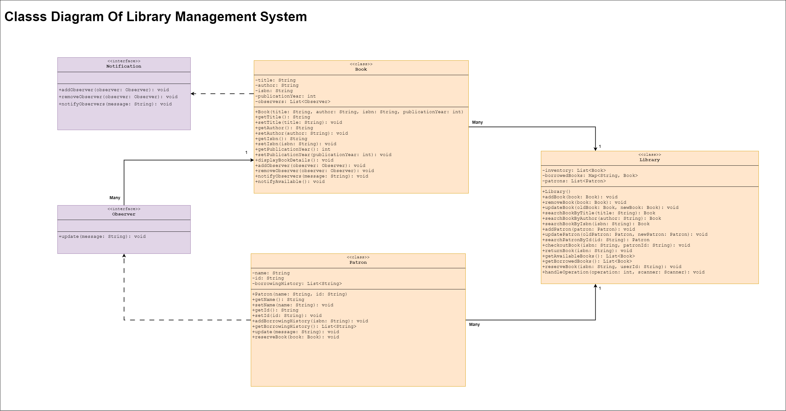

# Library Management System

## Overview
This Library Management System is a Java-based application designed to manage books, patrons, and lending processes in a library. It provides functionality for book and patron management, book checkout and return, and a reservation system.

You can find output of the project code in the [SampleOutput](extras/SampleOutput.txt) file.

## Features
- Book Management: Add, remove, update, and search for books
- Patron Management: Add and update patron information
- Lending Process: Checkout and return books
- Inventory Management: Track available and borrowed books
- Reservation System: Allow patrons to reserve books and receive notifications

## Project Structure
- `org.airtribe.book`: Contains the Book class
- `org.airtribe.patron`: Contains the Patron class
- `org.airtribe.library`: Contains the Library class which manages the core functionality
- `org.shared`: Contains Observer and Notification interfaces for the reservation system
- `org.example`: Contains the Main class to run the application

- Here is the class diagram for the project: 

## How to Run
1. Compile all Java files in the project
2. Run the Main class
3. Follow the on-screen prompts to interact with the system

## Main Operations
1.  Add a book
2.  Remove a book
3.  Update a book
4.  Search book by title
5.  Search book by author
6.  Search book by ISBN
7.  Add a patron
8.  Update a patron
9.  Checkout a book
10. Return a book
11. Reserve a book 
12. Available books
13. Borrowed books 
14. Exit

## Technical Details
- Implemented in Java
- Uses Object-Oriented Programming concepts
- Implements the Observer design pattern for the reservation system
- Utilizes Java collections (List, Map) for data management

## Future Improvements
- Implement multi-branch support
- Add a recommendation system based on patron borrowing history
- Integrate a logging framework
- Implement additional design patterns

## Contributors
Deep Patadiya

